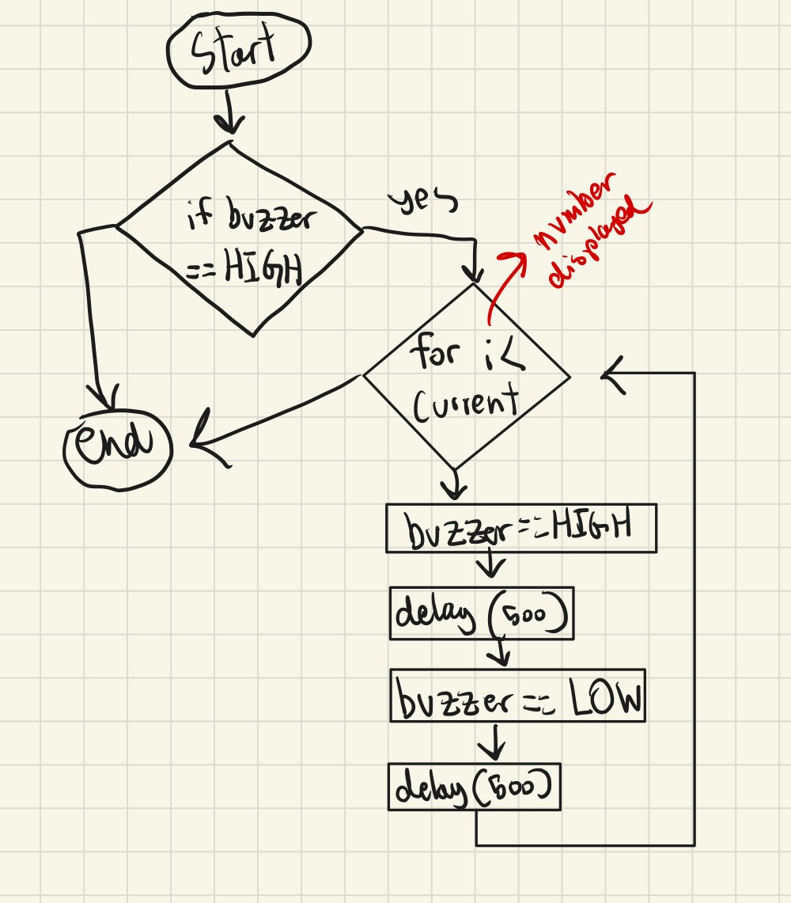
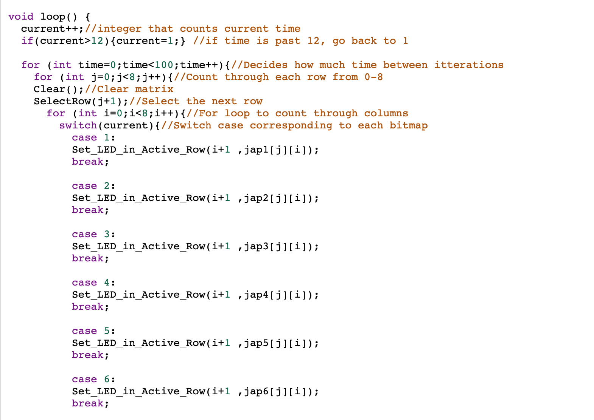
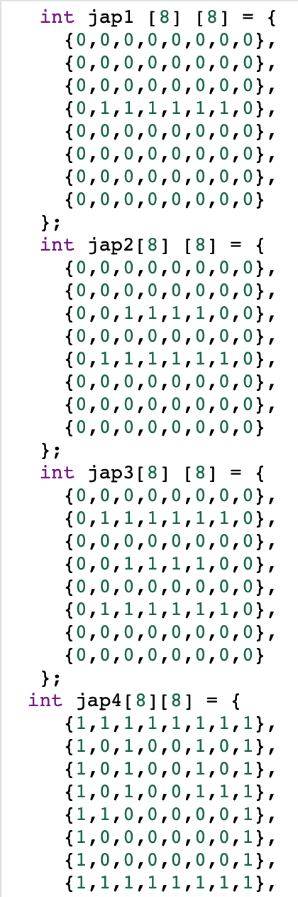

# Unit 2 Project: Multi-Sensor Counter

## Criteria A: PLanning

### Problem Definition
The client is an old Japanese man who does not know Roman numerals as he has lived in the country-side all his life. He would like a multisensor counter that would allow the user to count up and down from a set start.

### Success Criteria
1. The counter should be functioning and constantly displaying the numbers 1-12.
3. The buzzer should make a sound when the button is pressed.
4. Japanese Kanji should be displayed.
5. After displaying 12, it should go back to 1.
6. when the buzzer plays a sound, the counting should be halted until the buzzing stops.

### Design statement
We will design and make a digital counter for a client who can only read and understand numbers in Japanese Kanji which will be displayed using an 8x8 matrix. An additional component will be designed to accomodate the blind which will be in the form of a buzzer that will buzz the number being displayed by the counter. This counter will be constructed using tinkercad and the arduino ide and will take 3 weeks to make and be evaluated according to the criteria set above. 

### Rationale for Proposed Solution
For the counter, we will be using an Arduino as, according to researchgate, it does not need external programming, it is open source, and inexpensive compared to alternative processors such as Teensey 3.6 or the Amica NodeMCU. In addition, since we are making a multi-sensor counter we need to attach parts which is simple using an Arduino. Furthermore, as different parts will be attached to the Arduino, we need a powerful processor. Compared to the Teensey 3.6 or the Amica NodeMCU, the Arduino is more powerful (opensource.com). We are attaching a 8 by 8 grid of LED lights to the Arduino to display the counted number. As we are displaying Kanji, this is the best option. Furthermore, we are attaching a buzzer to play a sound according to the number being displayed when it is a button is pressed. Along with the Arduino, we will be using the language C as, according to C-sharp-corner, it is not only powerful but also a very structured language. Furthermore, as C is the only language with the ability to code an Arduino, we cannot use other languages such as Python or JavaScrip (circuito.com).

### Details
Our counter will be continuously displaying numbers in kanji without the need for inputs. The numbers displayed are 1 to 12 in order. Once it surpasses 12, it goes back to 1. The numbers will be displayed on a grid of LED lights arranged in 8 x 8 that are attached to the Arduino. We will also be attaching a buzzer to buzz the number of times displayed on the grid as our other sense for criterion A. The buzzer is activated when a button is pressed. When the buzzer is buzzing, the displaying of numbers is halted.  

### Citation
1. Circuito. (2018, March 11). Everything you need to know about arduino code. circuito.io blog. Retrieved December 16, 2021, from 
2. Mohammed, M. A. (2017, November 9). What are the advantages and disadvantages of Arduino ... Research Gate. Retrieved December 11, 2021
3. Talari, S. (n.d.). Top 10 advantages of the C programming language. C# Corner. Retrieved December 11, 2021
4. Red Hat. (n.d.). What is an Arduino? Opensource.com. Retrieved December 16, 2021

## Criteria B: Solution Overview

### System Diagram

Figure 1. System diagram for the proposed solution

As shown in Fig.1, the proposed solution runs on C and it is developed using Tinkerkad. The proposed counter has one input which is a button. No matter if the button is pressed, numbers will automatically be displayed. The pressing of the button will cause the buzzer to make sounds.

### Flow Diagrams

Figure 2. A flow diagram depicting the clear function, which negates ghosting by resetting all led's to low.

Figure 3. The select row function is used in conjunction of a for loop, to itterate through which row is selected. Making whichever row currently selected grounded, and the rest are given 5v to make sure no led ghosting is prevalent.

Figure 4. This flow diagram showcases how the buzzer system works. Whenever the button is pressed, the buzzer buzzes and turns silent. This repeats the same number of times as the number displayed. 

### Test Plan

Figure 5. The unit testing

Figure 6. A portion of our code to showcase code review.

| Description                                                                                                                                                                                    | Type              | Inputs                                                                                                                                                                               | Output                                                                                                                                                                                                                  | Evidence of output                                       |
|------------------------------------------------------------------------------------------------------------------------------------------------------------------------------------------------|-------------------|--------------------------------------------------------------------------------------------------------------------------------------------------------------------------------------|-------------------------------------------------------------------------------------------------------------------------------------------------------------------------------------------------------------------------|----------------------------------------------------------|
| Testing if the LED lights display one kanji                                                                                                                                                    | Unit Testing      | 1. Start the program. 2. As the program automatically displays the hour of the day, inputs are not necessary. 3. End the program.                                                    | The LED lights should display one kanji. Furthermore, the kanji should continuously display.                                                                                                                            | Figure 5                                                 |
| Testing if the entire program works. Therefore, if the system is able to display the appropriate time in kanji. Additionally, testing if the buzzer projects sound when the button is pressed. | System Testing    | 1. Start the program. 2. The hour of the day should automatically display. 3. Press the button for the buzzer to buzz the hour of the day it is. 4. End the program.                 | The LED lights should firstly, display the kanji for 1-12 continuously. After the number 12 is displayed, it should repeat with 1. If the button is pressed, the buzzer should buzz the number displayed on the lights. | https://www.youtube.com/watch?v=IPjifPTA_dM              |
| Testing how smooth the kanji switches as the hour changes.                                                                                                                                     | Load Testing      | 1. Start the program. 2. As the program automatically displays the hour of the day, inputs are not necessary. 3. End the program.                                                    | The kanji numbers displayed should change with minimal glitches or delays. Overall, the loading should be smooth.                                                                                                       | https://www.youtube.com/watch?v=4xQ4ACe_aAI              |
| Testing how easy it is for users to use the counter.                                                                                                                                           | Usability Testing | 1. Start the program. 2. The counted number should automatically display. 3. Press the button for the buzzer multiply times to test if sound projects each time. 4. End the program. | The buzzer should be making a sound each time it is pressed (on Tinkered sound is displayed by a signal). Furthermore, when the buzzer is pressed, the counting should be at a halt.                                    | https://youtu.be/W7wTPOu9ji4                             |
| Reviews if the code has adequate comments, function name, and variable name.                                                                                                                   | Code Review       | As this reviews the quality of the code, there are no inputs.                                                                                                                        | The code will contain comments to explain what is going on in the code. Furthermore, names of variables are simple.                                                                                                     | The comments and variable names can be seen in figure 6. |

### Record Of Tasks
| Task No. | Planned Action | Planned Outcome | Time Estimate | Target Completion Date | Criteria |
|:---:|:---:|:---:|:---:|:---:|:---:|
| 1 | Talk about a time system | Decide on time system | 1 Class | End of class, Nov 3rd | C |
| 2 | Create System Diagram | Finish a system diagram  that explains the idea | 20 Minutes | In class, 2021-12-08 | B |
| 3 | Create bitmap of numbers | Bitmap for 1-6 complete | 45 Minutes | Dec 11th | B |
| 4 | Finish Bitmap | Bitmap 7-12 complete | 1 Hour | Dec 12th | B |
| 5 | Create LED Matrix on tinkercad | 8x8 LED Setup | 30 Mins | Dec 12th | B |
| 6 | Create matrix prototype, counting hours | Count Hours in kanji on matrix | 1.5 Hours | Dec 13th | B |
| 7 | Find solution to display image for a extended period of time | Working matrix prototype that can show hours | 1 Hour | Dec 14th | B |
| 8 | Bug still not fixed,  moving on to try to work the piezo buzzer | Connect peizo buzzer,  find a way to coordinate with a led and show am vs pm | 1 Hour | Dec 15th | B |
| 9 | Fix bug with Dr. Ruben's help, get buzzer beeping the correct amount | Matrix is stable, buzzer beeps time when button is pressed | 1 Hour | Dec 15th | B |
| 10 | Ensure all code is commented, comment when necessary | Headers and all comments complete | 15 Mintues | Dec 15th | B |
| 11 | Flowcharts for Clear(), SelectRow(), and Set_LED_In_Active_Row() | Finish flowcharts | 45 Minutes | Dec 16th | B |
| 12 | Write out a description for criteria C | Have a majority of criteria C writing completel | 1.5 Hours | C |  |

## Criteria C: Development

## Techniques used

1. For loops
2. Functions
3. If statements
4. Switch case
5. Bitmaps
6. Multiplexing
7. Persistence of vision

## Development

Figure 7. The code to automatically display the appropriate number on the grid.

To solve the first criterion in the clients requirement,we decided to create a counter from 1 to 12 as shown in Fig. 1. through the use of a multiplexed eight by eight LED matrix, and persistence of vision. Through bitmaps of each kanji character, we can set the columns to the appropriate values and, through itterating through which row is grounded, we can control all rows at once with persistence of vision. We have the counter variable, counting the current time, and then we ittirate through each column of each row, comparing it to the bitmaps stated in the beginning of the code, and setting the LED's as they should be in respect to the bitmaps. This is done through a series of for loops, one to set the time gap between each number, one for loops counts through rows, and one counts through columns within the rows. We use a switch case statement, combined with the function Set_LED_In_Active_Row, which sets the LED's based off of the values in the corresponding columns on the bitmap. Then by itterating through all rows, and all columns, at a fast rate, the LED's seem on even when they are not, creating the persistence of vision effect.

Using loops and if statements, the numbers add 1 each time. If it reaches 12, the program will go back to 1. The next for loop determines how much time is spend between itterations. The clear variable clears the grid after the number 12 is reached. The next for loop goes through rows and columns of the LED lights to determine which light should be on. This is done by counting each row and column from 1-8. The switch case corresponds to the bitmap coded earlier. The number next to the case determines the bitmap it corresponds with. For example, case 1, corresponds with jap1 which is the bitmap for the first number.

Figure 8. The code to figure out which LED lights should be lit.

Figure 9. The code showcasing the bitmaps used to turn specific lights on.

### Sources
