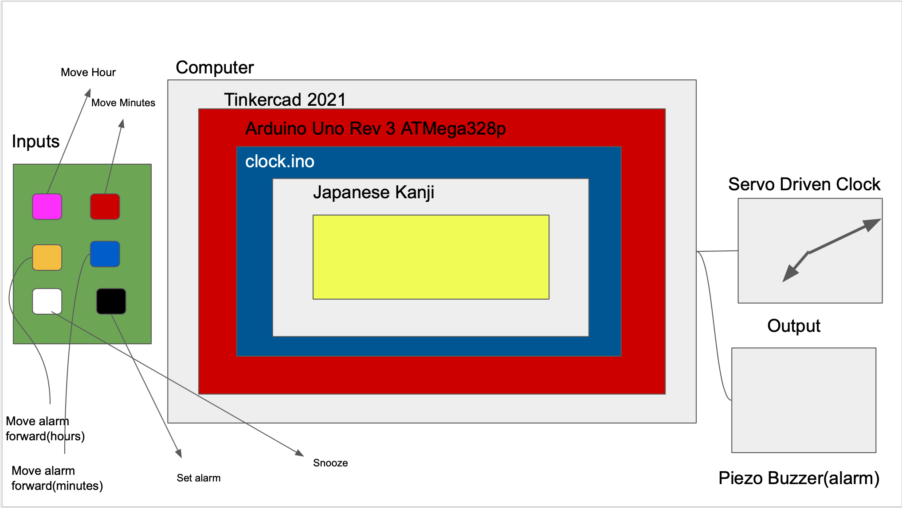

# Unit 2 Project: Multi-Sensor Counter

## Criteria A: PLanning

### Problem Definition
The client is an old Japanese man who does not know Roman numerals as he has lived in the country-side all his life. He would like a multisensor counter from 0 to 9 that would allow the user to count up and down from a set start.

### Rationale for Proposed Solution
For the counter, we will be using an Arduino as, according to researchgate, it does not need external programming, it is open source, and inexpensive. In addition, since we are making a clock, we need to attach parts which is simple using an Arduino. We are attaching a servo to the Arduino to imitate the turnings of a clock. Furthermore, we are attaching a buzzer to play a sound when the alarm goes off. Along with Arduino, we will be using the language C as, according to C-sharp-corner, it is not only powerful but also a very structured language.

### Success Criteria
1. The clock should be functioning and display the appropriate time
2. The alarm should buzz a sound when it goes off

### Design statement
I will design and make an alarm clock for a client who is blind and deaf. The clock will count in morse and is constructed using tinkercad and the arduino ide It will take 6 weeks to make and will be evaluated according to the criteria to be decided.

### Record Of Tasks

| Task No. |      Planned Action      |                 Planned Outcome                 | Time Estimate | Target Completion Date | Criteria |
|:--------:|:------------------------:|:-----------------------------------------------:|:-------------:|:----------------------:|:--------:|
|     1    | Talk about a time system |              Decide on time system              |    1 Class    |  End of class, Nov 3rd |     C    |
|     2    |   Create System Diagram  | Finish a system diagram  that explains the idea |   20 Minutes  |  In class, 2021-12-08  |     B    |
|     3    |                          |                                                 |               |                        |          |

### Citation
1. Mohammed, M. A. (2017, November 9). What are the advantages and disadvantages of Arduino ... Research Gate. Retrieved December 11, 2021
2. Talari, S. (n.d.). Top 10 advantages of the C programming language. C# Corner. Retrieved December 11, 2021

## Criteria B: Solution Overview

### System Diagram

